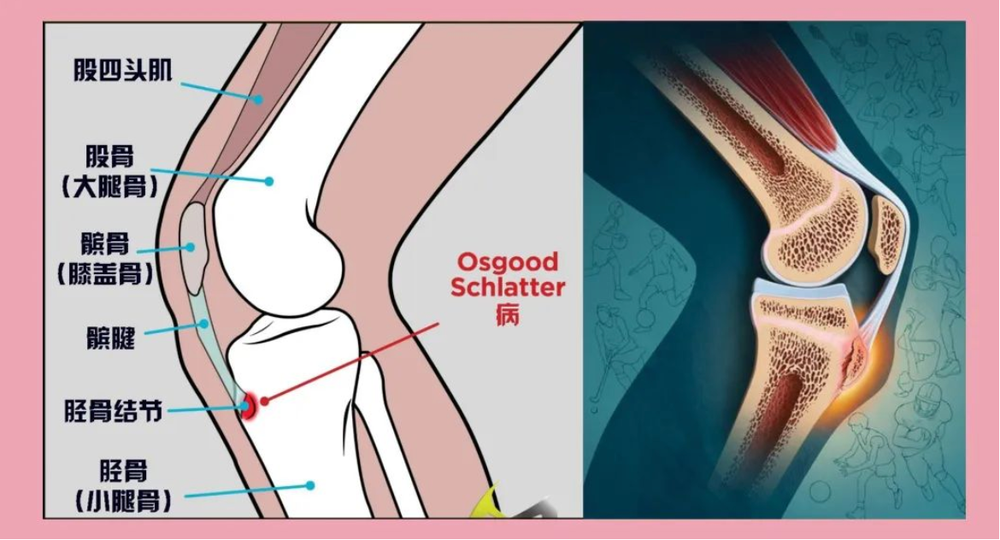

# T2｜膝前疼痛检测方案与自测记录（A+B+A4 完整版）

> 文件层级：Task（T2）服务对象：S1（机制初判） → S2（训练计划
> v1）核心目标：
>
> 1) **区分更可能的机制 / 部位（A 类）**
> 2) **排除不应继续训练型路径的情况（A4）**
> 3) **在当前机制下确定可加载 vs 需回避窗口（B 类）**

---

## 一、检测目的

- 不追求医学确诊
- 目标是把"膝前疼"压缩为：
  - 更可能的力学机制
  - 可执行的训练约束条件
- 若出现胫股关节明确阳性信号 → **暂停训练型推进**

---

## 二、检测通用原则（必须遵守）

- ❗ 疼痛评分 ≥ **5 / 10** → 立即停止该测试
- ❗ 不做爆发、不做疲劳测试
- ❗ **24h 反应优先级 \> 当下感觉**
- ❗ 所有测试都应 **可重复、可描述**

---

## 三、疼痛地图（静态定位）

### 3.1 主要痛点

- 文字描述（精确到区域）：
  - 例如：髌骨下缘正中 / 偏内侧 / 偏外侧
- 形态：□ 点状 □ 条索样 □ 片状
- 是否随伸直明显加重： □ 是 □ 否

### 3.2 按压反应（轻压即可）

- 髌骨下缘中央：  明显
- 髌韧带中段： 无
- 髌下脂肪垫区域： 无

> 备注：髌骨下缘，小腿骨上缘胫骨结节处疼痛，以及髌骨上缘与股四头肌连接处疼痛
>
> 

---

# A 类｜机制 / 部位区分测试

> 目标：**在不预设机制的前提下，压缩机制空间**

---

## A1｜伸膝末端 vs 中等屈曲角对比（核心）

**目的** 区分：低屈曲角张力/压力主导 vs 中等屈曲角同样不耐受

**测试方式**

- A1-1：坐姿，从约 **30° → 接近伸直**，缓慢伸膝
- A1-2：固定在约 **45° 屈膝**，等长用力 5--10 秒

**记录**

- A1-1 即时疼痛（0--10）：3（10度左右最疼）
- A1-2 即时疼痛（0--10）：1
- 疼痛主要位置：髌骨上方
- 次日 24h 反应： 好转

**判读提示**

- 末端明显更痛、45°可耐受 → 支持低角度问题
- 两者相近或 45°更痛 → 机制未收敛，需保守

---

## A2｜直膝 vs 微屈膝踮脚（膝 vs 踝区分）

**目的** 判断踮脚痛来自膝前稳定需求，还是踝/跟腱本体

**测试方式**

- A2-1：直膝单脚踮脚
- A2-2：微屈膝（≈20°）单脚踮脚

**记录**

- A2-1 疼痛（0--10）：0 位置：\_\_\_\_\_\_\_\_
- A2-2 疼痛（0--10）：0.5 位置：胫骨结节处
- 次日 24h 反应： 好转

**判读提示**

- 直膝更痛、痛在膝前 → 支持膝前结构
- 两者都痛、痛在跟腱 → 踝因素需重新纳入

---

## A3｜完全伸直 vs 轻度屈膝静态站立（脂肪垫筛查）

**目的** 筛查髌下脂肪垫夹挤可能

**测试方式**

- A3-1：完全伸直站立 20--30 秒
- A3-2：轻度屈膝站立 20--30 秒

**记录**

- A3-1 不适（0--10）：1（5s时胫骨结节处疼痛）
- A3-2 不适（0--10）：0
- 不适差异明显： 是

**判读提示**

- 伸直明显更不适 → 脂肪垫优先级↑

---

## A4｜胫股关节排除性筛查（rule-out）

> 角色说明： **不是为了"证明胫股关节是主因"，
> 而是判断"是否不适合继续训练型路径"。**

---

### A4-1｜深屈膝静态耐受（非旋转）

**目的** 筛查胫股关节在高屈曲位是否明显不耐受

**测试方式**

- 双脚站立
- 缓慢下蹲至 **当前舒适的最深位**（不强求）
- 停留 5--10 秒

**记录**

- 即时不适（0--10）：2
- 是否有卡住 / 顶住感： 否
- 次日 24h 反应： 好转

**判读提示**

- 无明显不适 → 支持剪枝
- 明显不适 / 卡顿 → 胫股关节优先级↑

---

### A4-2｜坐姿轻度旋转感受（极小幅度）

**目的** 筛查旋转是否为关键触发因素（半月板线索）

**测试方式**

- 坐姿，膝屈约 90°
- 脚尖做 **极小幅度** 内旋 / 外旋
- 不加负重、不追求幅度

**记录**

- 内旋不适（0--10）：0
- 外旋不适（0--10）：0
- 是否有特异性刺痛/卡感： 否

**判读提示**

- 无明显反应 → 半月板可能性低
- 明显不适 → 需谨慎，暂停训练型推进

---

### A4-3｜单脚承重稳定感（非疼痛）

**目的** 筛查功能性不稳（韧带/控制问题）

**测试方式**

- 单脚站立 20--30 秒
- 不做屈伸、不晃动

**记录**

- 是否明显不稳/恐惧： 否

**判读提示**

- 稳定 → 支持非韧带不稳
- 明显不稳 → 需提高警惕

---

## A 类小结｜机制倾向判断

> 请选择**当前更支持的一项**（允许不确定）

**“膝前伸膝系统（以髌股关节低角度压力 + 伸膝链条张力为主）的**

> **轻度/反应性不耐受状态”，**
>
> **伸膝装置张力相关不耐受**
>

---

# B 类｜加载窗口测试

> 前提：**A4 未出现明确"停止信号"**

---

## B1｜低屈曲角加载耐受性（风险窗口验证）

- 动作：弓步走
- ROM / 次数：25
- 即时疼痛（0--10）：0
- 24h 反应： 好转

---

## B2｜中等屈曲角加载耐受性（安全窗口候选）

- 动作：坐姿器械腿屈伸
- 形式： □ 等长
- 即时疼痛（0--10）：1（维持30s，最后5s疼痛）
- 24h 反应：好转

---

## B3｜稳定性需求测试（可选）

- 动作：\_\_\_\_\_\_\_\_
- 支撑方式： □ 双侧 □ 单侧
- 即时疼痛（0--10）：\_\_\_\_
- 24h 反应： □ 好转 □ 无变化 □ 更痛

---

## B 类小结｜窗口判定

### 高风险窗口（暂时回避）

### 潜在可加载窗口

---

## 六、阶段性结论（供 S2 使用）

- 当前最支持的机制：问题集中在膝前伸膝装置/髌股系统
- 是否支持 H1（训练调节可解决）：□ 是 □ 否 □ 不确定
- 是否需要立即降载 / 停训： □ 否 □ 是（原因：\_\_\_\_\_\_\_\_）

A1 显示“**接近伸直更敏感，45°更耐受**”，这是典型的膝前系统（髌股压力/伸膝装置张力）窗口特征。**  **

压痛集中在髌骨下缘中央，同时你还有髌骨上缘（股四头肌腱/髌上囊附近）与胫骨结节（髌韧带胫骨止点）相关不适的描述，整体更像“伸膝链条”里某些点处于敏感/反应性状态。** **

---

## 七、下一步决策

- □ 进入 S2：制定训练计划 v1
- □ 保守运行，延长观察
- □ 出现异常信号，考虑医疗评估

---

> 记录日期：\_\_\_\_\_\_\_\_ 执行人：\_\_\_\_\_\_\_\_

---
